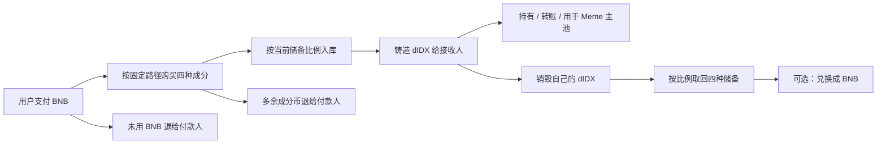

# BEP-888 · MemeDAQ

**Meme 纳斯达克指数｜让 Meme 可以组合持有。**

四币实物储备、BNB 一键铸造、份额按比例赎回。MemeDAQ 将多个 Meme 的组合持有做成可验证的链上流程，为同题材社区提供共同参与的入口。

[网站](https://memedaqindex.com) · [dIDX 铸造与赎回](https://memedaqindex.com/#/basket) · [中文提案](proposal/BEP-888.zh-CN.md) · [English specification](proposal/BEP-888.md) · [创新与实用性](docs/INNOVATION.zh-CN.md) · [主网合约](deployments/bsc-mainnet.json)

> BEP-888 是本项目的协议名称与提案代号。本仓库是项目提案与参考实现，不表示 BNB Chain 官方已经分配 888 编号、受理或批准该标准。当前主网实现与提案受理状态分别记录。

## 为什么做这个

同一个 Meme 题材可能出现多个代币，社区注意力与参与入口随之分散。用户往往需要分别买入、管理，再在不同代币之间反复切换。

篮子提供一种共同参与的工具：把选定代币作为真实链上储备，用一份可赎回份额组合持有。它减少分别管理成分币的操作，并为社区联合展示、组合参与和新 Meme 的交易计价提供入口。是否能改善社区协作仍取决于实际采用情况。

## 当前可用

| 能力 | 当前实现 |
| --- | --- |
| 实物储备 | dIDX 默认篮子固定持有龙虾、牛来、永生果蝇、哈基咪四种链上代币 |
| BNB 一键铸造 | 一笔交易自动买齐四种成分、按储备比例存入并发行份额 |
| 退款 | 未花费 BNB 与未用于铸造的成分币退回付款方；成分币不再次兑换 |
| 实物赎回 | 销毁持有者自己的份额，按比例取回当前四种储备 |
| 换回 BNB | 通过已配置 Gateway 赎回，再沿固定路径兑换；受最低到账限制 |
| 组合计价 | 新 Meme 可以在已启用的 meme/dIDX 主池中交易 |
| 净值与指数 | 净值对应每份实际储备；参考指数衡量成分价格表现，二者分别计算 |

“实物”指篮子实际持有的链上成分代币。普通 Meme 的名字包含 IDX，不会因此取得篮子赎回权。



## 创新组合在哪里

1. **Meme 场景下的共同组合入口**：将真实储备、组合份额和社区参与连接起来。
2. **一笔 BNB 完成进入**：成分购买、比例存入、铸造与原币退款原子执行，用户无需提前持有四种成分。
3. **按实际到账记账**：成分转账税不被计为储备，铸造与赎回对实际到账和取整作明确限制。
4. **组合份额作为 Meme 主池计价资产**：将普通 Meme 的交易、税费结算与储备份额连接起来。
5. **独立组合、独立权益**：每种篮子使用自己的份额、储备和路径，页面切换不会改变原有持仓。

这些是本项目的产品与工程组合，不宣称首次发明可赎回篮子。详见[创新与实用性](docs/INNOVATION.zh-CN.md)。

## BROCCOLIIDX 与后续方向

设想将多个 Broccoli 题材代币组成独立储备篮子，用 BROCCOLIIDX 份额组合持有，减少用户只选一个、再反复换仓的操作，为不同社区提供共同参与入口。

**这是扩展示例，当前没有开放任意 Broccoli 地址建篮。** 原有代币和交易池仍然各自存在。当前每篮固定四币；MDAQ 接入且对应篮子、价格源、路径和储备准备完成后，可逐步启用五选四。更多候选、任意主题和 N 币篮子需要进一步扩展合约。

## 源码导航

| 模块 | 作用 |
| --- | --- |
| [DidxBasket](src/index/DidxBasket.sol) | 固定四币储备、份额铸造、按比例赎回 |
| [DidxRefundGateway](src/index/DidxRefundGateway.sol) | BNB 一笔进入、精确比例存入、退回多余资产 |
| [DidxGateway](src/index/DidxGateway.sol) | 固定 V2/V3 购买路径、赎回并兑换 BNB |
| [DidxNavFeed](src/index/DidxNavFeed.sol) | 链上储备份额净值源 |
| [DidxBasketRegistry](src/index/DidxBasketRegistry.sol) | 五选四候选及独立篮子登记 |
| [MemeBasketIndex](src/index/MemeBasketIndex.sol) | 独立的成分价格参考指数 |
| [IndexPriceSources](src/index/IndexPriceSources.sol) | Chainlink、V2/V3 均价与有效性检查 |
| [测试](test/) | 储备、退款、价格源和主池整合测试 |

为保证原始 dIDX 文件可编译，本仓库同时包含它们导入的发射台、交易路由、回购、接口及测试辅助源码。这些文件按原项目内容复制；[源文件哈希](deployments/source-manifest.json)用于核对导出内容。

## 编译与测试

安装 [Foundry](https://getfoundry.sh/introduction/installation/)，然后：

```bash
git clone --recurse-submodules https://github.com/kontulbunder-oss/BEP-888.git
cd BEP-888
forge build
forge test -vv
```

已有克隆可运行 `git submodule update --init --recursive`。依赖由 Git 子模块锁定到具体提交，编译器固定 Solidity 0.8.26；测试在本地 EVM 执行，不需要私钥、主网资金或 RPC。测试覆盖范围见[验证说明](docs/VALIDATION.md)。

## 阅读顺序

- 社区与产品：从本页到[创新与实用性](docs/INNOVATION.zh-CN.md)。
- 提案审阅：阅读[中文规范](proposal/BEP-888.zh-CN.md)或[英文规范](proposal/BEP-888.md)。
- 开发接入：阅读[实现与公式](docs/IMPLEMENTATION.zh-CN.md)、[BNB 铸造接口](docs/didx-bnb-mint.md)及[权限边界](docs/PERMISSIONS.md)。
- 链上核对：使用[主网部署清单](deployments/bsc-mainnet.json)与[复现检查](docs/VALIDATION.md)。

## License

本项目 Solidity 文件保留 `GPL-2.0-or-later` 声明，许可证见 [LICENSE](LICENSE)。本仓库新增项目文档按相同许可证提供。第三方依赖保留各自许可证与版权声明，见 [NOTICE](NOTICE)。
