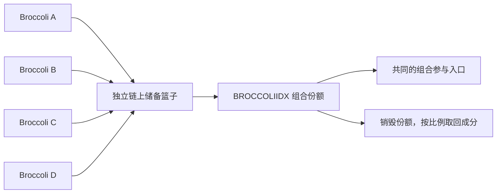

# 创新组合与实用性

## 解决的具体操作问题

一个题材对应多个 Meme 时，用户要分别判断、买入、保存仓位和退出。对希望参与整个题材的用户，这会带来多次操作、余额碎片和反复换仓的成本；社区也缺少可共同指向的组合入口。

MemeDAQ 的方案是在链上实际持有选定成分，发行可按比例赎回的份额，再把 BNB 进入、份额退出与 Meme 主池计价接在一起。目标是降低组合参与的操作复杂度，为缓解分流提供工具。

## 创新点与代码对应

| 产品设计 | 实用性 | 对应实现 |
| --- | --- | --- |
| 多个 Meme 对应一份储备权益 | 用户可以组合持有，减少分别管理各币的操作 | `DidxBasket.assets / reserves / deposit / redeem` |
| BNB 购买、比例入库、铸造原子执行 | 不必提前买齐和授权四种成分，任一步失败整笔回滚 | `DidxRefundGateway.mintFromBnb`、`DidxGateway.buyAssets` |
| 多余成分原币退回付款方 | 不必再次卖出，避免一次额外兑换；付款与接收地址可以不同 | `DidxRefundGateway._returnAssets / _refundNative` |
| 按实际净到账发行份额 | 扣税部分不会虚增抵押储备；最小配比约束避免无储备增发 | `DidxBasket._pull / deposit` |
| 按当前储备比例退出 | 核心实物赎回不依赖美元预言机价格 | `DidxBasket.redeem` |
| 篮子份额成为 Meme 主池计价资产 | 普通 Meme 交易、税费与分红可以以对应组合份额结算 | `MemeDaqLaunchpad.launchBasket`、`MemeDaqRouter`、`MemeDaqHook` |
| 每种组合单独登记、独立核算 | 明确每份资产权利对应哪个篮子，不将不同组合混为同一资产 | `DidxBasketRegistry`、`test/DidxFiveChooseFour.t.sol` |

创新在这些机制针对 Meme 场景的组合与落地方式。可赎回篮子、代币份额、原子交易和现有 DEX 各自已有先例，不把这些基础概念单独宣称为本项目首创。

## BROCCOLIIDX 示例

假设一个主题有 Broccoli A、B、C、D 四个独立代币。未来可建立一个只持有这四项资产的篮子，发行 BROCCOLIIDX，用户用一份份额组合参与四个社区。

这使“参与整个题材”成为一种可实现的产品形式。原有代币、发行者和交易池仍各自存在，篮子不会机械地合并外部流动性或消除社区竞争；改善协作的效果需要使用数据与社区实践验证。这里的 Broccoli 仅是主题示例，不暗示任何人物或项目背书。

当前没有任意地址建篮功能。BROCCOLIIDX 需要独立合约、真实成分储备、价格源与兑换路径完成接入后才能开放，普通 Meme 仅采用同名或 IDX 后缀不会获得赎回权。

## 当前与未来

| 阶段 | 范围 |
| --- | --- |
| 当前 | 已部署的默认四币 dIDX，BNB 一键铸造、原币退款、份额赎回 |
| 平台币接入后 | 五个候选中选四的独立组合；每个组合需配置与初始化后启用 |
| 后续扩展 | 更多 Meme 候选、主题篮子、N 币接口和创建流程 |

现有 `DidxBasket` 固定四项且不可升级，不能通过修改页面把它变成 N 项。扩展需要新合约及独立迁移或新篮子安排，已有持有者的资产权利不应被页面配置隐式改变。

## 如何验证实用性

建议后续公开记录：完成一次组合进入需要的签名与交易次数、铸造/赎回成功率、用户实际退款、报价与成交偏差、组合参与钱包数、不同主题社区的采用情况。当前仓库提供机制和可复现测试，不虚构社区团结或减少亏损的统计结果。
